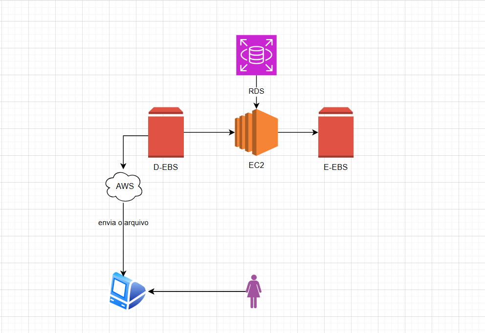

# Desafio do Bootcamp CodeGirls ☁️

# Fundamentos AWS: EC2, AMI e Snapshots

Este repositório contém um resumo de conceitos essenciais da AWS, voltado para iniciantes que desejam entender e trabalhar com **instâncias EC2**, **imagens AMI** e **snapshots EBS**.

---

## °AWS (Amazon Web Services)

A **AWS** é uma plataforma de serviços de computação em nuvem, que fornece recursos sob demanda através da internet. Com a AWS, você pode criar servidores, armazenar dados, hospedar sites, e muito mais, sem precisar de hardware físico próprio.

Principais conceitos:
- **Serviços sob demanda**: você paga apenas pelo que usar.
- **Elasticidade**: pode aumentar ou diminuir recursos conforme necessário.
- **Segurança**: oferece controle de acesso e criptografia de dados.

---

## °Instâncias EC2

O **EC2 (Elastic Compute Cloud)** é o serviço de servidores virtuais da AWS. Com ele, você cria máquinas virtuais chamadas **instâncias** para executar aplicações, testes ou serviços web.

### Tipos de instâncias
As instâncias variam de acordo com recursos de **CPU**, **memória**, **armazenamento** e **rede**:
- **T2/T3**: econômicas, boas para cargas leves.
- **M5/M6**: balanceadas, para uso geral.
- **C5/C6**: otimizadas para computação pesada.
- **R5/R6**: otimizadas para memória.

### Ciclo de vida de uma instância EC2
1. **Criar** → escolher AMI, tipo de instância e configurações.
2. **Executar** → instância ligada e rodando.
3. **Parar** → instância desligada, mas dados mantidos no EBS.
4. **Terminar** → instância deletada, dados podem ser perdidos se não estiverem em snapshot.

---

## °AMI (Amazon Machine Image)

Uma **AMI** é uma **imagem de máquina** que contém:
- Sistema operacional (Linux, Windows, etc.)
- Configurações iniciais
- Software pré-instalado (opcional)

Ela serve para:
- Criar novas instâncias EC2 com a mesma configuração rapidamente.
- Fazer backup completo de uma instância.

### Como criar e usar uma AMI
1. Configure a instância EC2 como deseja.
2. Vá no console da AWS → EC2 → **Create Image**.
3. Informe nome e descrição.
4. A nova AMI será usada para criar outras instâncias idênticas à original.

---

## °Snapshots EBS

O **EBS (Elastic Block Store)** é o armazenamento usado pelas instâncias EC2. Um **snapshot** é uma cópia de segurança do volume EBS.

### Características
- Baseado em **blocos**, ou seja, grava apenas alterações incrementais.
- Pode ser usado para:
  - Restaurar volumes
  - Criar novas AMIs
  - Backup seguro de dados

### Como criar um snapshot
1. Vá no console da AWS → EC2 → Volumes.
2. Selecione o volume que deseja salvar.
3. Clique em **Create Snapshot** e informe nome/descrição.

---

## °Como tudo se conecta

1. Você cria uma **instância EC2** usando uma **AMI**.
2. A instância armazena seus dados em **volumes EBS**.
3. Quando quiser fazer backup ou replicar a instância:
   - Crie um **snapshot** do volume EBS.
   - Ou crie uma **nova AMI** da instância.
4. Com a AMI, você pode lançar novas instâncias idênticas em minutos.

---

## Referências

- [Documentação oficial AWS EC2](https://docs.aws.amazon.com/ec2/index.html)
- [Documentação oficial AMI](https://docs.aws.amazon.com/AWSEC2/latest/UserGuide/AMIs.html)
- [Documentação oficial EBS Snapshots](https://docs.aws.amazon.com/AWSEC2/latest/UserGuide/EBSSnapshots.html)

---

> Este resumo serve como guia inicial para quem está começando a estudar AWS e quer entender como funcionam instâncias, imagens e backups de volumes.

